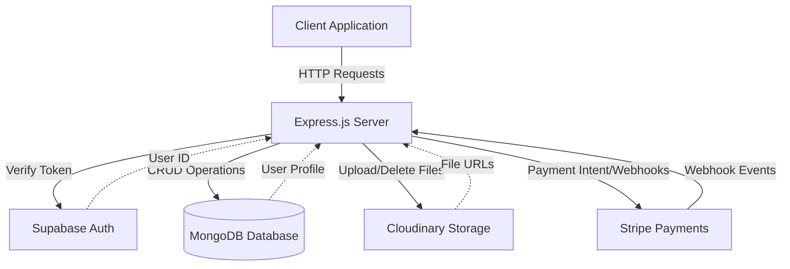
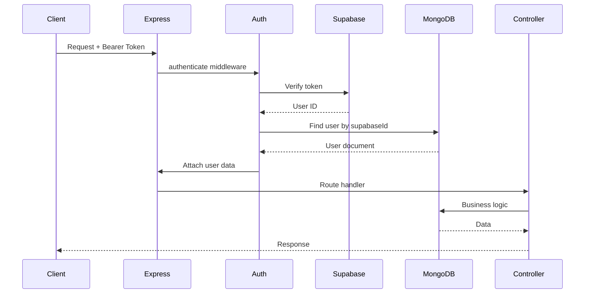
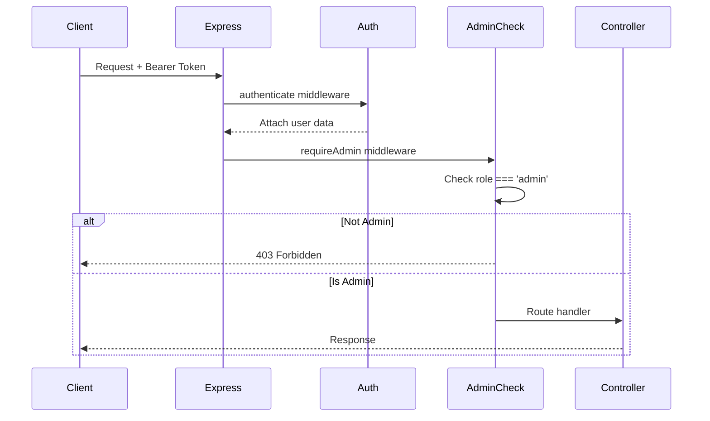

## Overview

The Vaniyk Empire API is built on a modern Node.js architecture that combines multiple cloud services to deliver a robust content management and payment platform. The system uses Express.js for the web framework, MongoDB for data persistence, Supabase for authentication, Cloudinary for media storage, and Stripe for payment processing.

## Architecture Diagram



## Core Components

### Express.js Server

The application uses Express.js as the web framework, configured in `/workspace/source/src/server.js:1`.

<CodeGroup>
```javascript Server Configuration
const express = require('express');
const app = express();

// IMPORTANT: Webhook route must be registered BEFORE express.json()
app.use('/api/payments', paymentRoutes);

// Middleware
app.use(express.json());

// Routes
app.use('/api/auth', authRoutes);
app.use('/api/content', contentRoutes);
app.use('/api/categories', categoryRoutes);

const PORT = process.env.PORT || 3000;
app.listen(PORT);
```
</CodeGroup>

<Warning>
The payment webhook route MUST be registered before `express.json()` middleware to allow Stripe to send raw request bodies for signature verification.
</Warning>

### MongoDB with Mongoose

MongoDB serves as the primary database, handling all persistent data including users, content, purchases, and categories. Connection is managed through Mongoose ODM.

<CodeGroup>
```javascript Database Connection
// config/database.js
const mongoose = require('mongoose');

const connectDB = async () => {
  try {
    await mongoose.connect(process.env.MONGODB_URI);
    console.log('MongoDB connected');
  } catch (error) {
    console.error('MongoDB connection error:', error);
    process.exit(1);
  }
};
```
</CodeGroup>

#### Data Models

The system uses four primary Mongoose models:

<AccordionGroup>
  <Accordion title="User Model" icon="user">
    Stores user profiles linked to Supabase authentication.
    
    ```javascript
    {
      supabaseId: String (unique),
      email: String (unique, lowercase),
      name: String,
      role: 'user' | 'admin',
      emailVerified: Boolean,
      createdAt: Date,
      updatedAt: Date
    }
    ```
    
    Location: `/workspace/source/src/models/User.js:1`
  </Accordion>

  <Accordion title="Content Model" icon="file">
    Manages all content items (PDFs, videos, audio).
    
    ```javascript
    {
      title: String,
      description: String,
      type: 'pdf' | 'video' | 'audio',
      category: String,
      price: Number,
      fileUrl: String,
      filePublicId: String,
      thumbnailUrl: String,
      thumbnailPublicId: String,
      duration: Number,  // For video/audio in seconds
      fileSize: Number,  // In bytes
      status: 'draft' | 'published',
      tags: [String],
      createdBy: ObjectId (User),
      createdAt: Date,
      updatedAt: Date
    }
    ```
    
    Includes text search index on `title`, `description`, and `tags` fields.
    
    Location: `/workspace/source/src/models/Content.js:1`
  </Accordion>

  <Accordion title="Purchase Model" icon="cart-shopping">
    Tracks all content purchases and payment status.
    
    ```javascript
    {
      user: ObjectId (User),
      content: ObjectId (Content),
      amount: Number,
      stripePaymentIntentId: String,
      status: 'pending' | 'completed' | 'failed' | 'refunded',
      purchasedAt: Date
    }
    ```
    
    Compound index on `(user, content)` prevents duplicate purchases and enables fast lookups.
    
    Location: `/workspace/source/src/models/Purchase.js:1`
  </Accordion>
</AccordionGroup>

### Supabase Authentication

Supabase handles all authentication and user identity management. The API validates JWT tokens on protected routes.

<CodeGroup>
```javascript Authentication Middleware
// middleware/auth.js
const authenticate = async (req, res, next) => {
  const token = req.headers.authorization?.replace('Bearer ', '');
  
  if (!token) {
    return res.status(401).json({ error: 'No token provided' });
  }

  // Verify token with Supabase
  const { data: { user }, error } = await supabase.auth.getUser(token);
  
  if (error || !user) {
    return res.status(401).json({ error: 'Invalid token' });
  }

  // Get full user data from MongoDB including role
  const mongoUser = await User.findOne({ supabaseId: user.id });
  
  if (!mongoUser) {
    return res.status(404).json({ error: 'User not found' });
  }

  req.user = user;          // Supabase user object
  req.mongoUser = mongoUser; // MongoDB user document
  next();
};
```
</CodeGroup>

<Info>
The authentication middleware attaches both `req.user` (Supabase) and `req.mongoUser` (MongoDB) to the request object, allowing access to both authentication data and application-specific user properties like roles.
</Info>

#### Admin Authorization

Admin-only routes use an additional middleware layer:

<CodeGroup>
```javascript Admin Middleware
const requireAdmin = async (req, res, next) => {
  if (!req.mongoUser) {
    return res.status(401).json({ error: 'Authentication required' });
  }

  if (req.mongoUser.role !== 'admin') {
    return res.status(403).json({ 
      error: 'Access denied. Admin privileges required.' 
    });
  }

  next();
};
```
</CodeGroup>

### Cloudinary Storage

Cloudinary manages all file storage for content files and thumbnails. The system uses `multer-storage-cloudinary` to handle uploads directly to Cloudinary.

<CodeGroup>
```javascript Cloudinary Configuration
// config/cloudinary.js
cloudinary.config({
  cloud_name: process.env.CLOUDINARY_CLOUD_NAME,
  api_key: process.env.CLOUDINARY_API_KEY,
  api_secret: process.env.CLOUDINARY_API_SECRET
});

const contentStorage = new CloudinaryStorage({
  cloudinary: cloudinary,
  params: async (req, file) => {
    let folder = 'content';
    let resourceType = 'auto';

    // Organize by file type
    if (file.fieldname === 'thumbnail') {
      folder = 'content/thumbnails';
      resourceType = 'image';
    } else if (file.mimetype.startsWith('video/')) {
      folder = 'content/videos';
      resourceType = 'video';
    } else if (file.mimetype.startsWith('audio/')) {
      folder = 'content/audio';
      resourceType = 'video';  // Audio uses video resource type
    } else if (file.mimetype === 'application/pdf') {
      folder = 'content/pdfs';
      resourceType = 'image';  // PDFs use image resource type
    }

    return {
      folder: folder,
      resource_type: resourceType,
    };
  }
});

const uploadContent = multer({ 
  storage: contentStorage,
  limits: {
    fileSize: 500 * 1024 * 1024 // 500MB limit
  }
});
```
</CodeGroup>

<Note>
Cloudinary categorizes files into different resource types: `image` (for PDFs and thumbnails), `video` (for videos and audio), and `auto` for automatic detection. Each content type is organized into separate folders.
</Note>

### Stripe Payments

Stripe handles all payment processing through Payment Intents and webhooks for asynchronous payment confirmation.

<CodeGroup>
```javascript Stripe Configuration
// config/stripe.js
const stripe = require('stripe')(process.env.STRIPE_SECRET_KEY);

module.exports = stripe;
```
</CodeGroup>

The payment flow uses:
- **Payment Intents** for secure client-side payment collection
- **Webhooks** for server-side payment confirmation
- **Metadata** to link payments to content and users

## Request Flow

### Authenticated Request Flow



### Admin Request Flow



## Environment Configuration

The system requires the following environment variables:

<CodeGroup>
```bash .env
# Database
MONGODB_URI=mongodb+srv://...

# Authentication
SUPABASE_URL=https://xxx.supabase.co
SUPABASE_ANON_KEY=xxx
SUPABASE_SERVICE_ROLE_KEY=xxx

# Frontend (for email redirects)
FRONTEND_URL=https://yourapp.com

# Admin
ADMIN_SECRET_KEY=your-secret-key

# Storage
CLOUDINARY_CLOUD_NAME=xxx
CLOUDINARY_API_KEY=xxx
CLOUDINARY_API_SECRET=xxx

# Payments
STRIPE_SECRET_KEY=sk_test_xxx
STRIPE_WEBHOOK_SECRET=whsec_xxx

# Server
PORT=3000
```
</CodeGroup>

## Error Handling

The application implements centralized error handling:

<CodeGroup>
```javascript Error Middleware
app.use((err, req, res, next) => {
  console.error(err.stack);
  res.status(500).json({ error: 'Something went wrong!' });
});
```
</CodeGroup>

Individual controllers handle specific errors with appropriate status codes:
- `400` - Bad Request (validation errors)
- `401` - Unauthorized (missing/invalid token)
- `403` - Forbidden (insufficient permissions)
- `404` - Not Found (resource doesn't exist)
- `500` - Internal Server Error

## Security Features

<CardGroup cols={2}>
  <Card title="JWT Authentication" icon="lock">
    All protected routes require valid Supabase JWT tokens
  </Card>
  
  <Card title="Role-Based Access" icon="shield">
    Admin routes protected with role verification
  </Card>
  
  <Card title="Webhook Verification" icon="signature">
    Stripe webhooks verified using signing secrets
  </Card>
  
  <Card title="File Size Limits" icon="file-circle-exclamation">
    Upload size limited to 500MB to prevent abuse
  </Card>
</CardGroup>

## Performance Optimizations

- **Database Indexing**: Text search index on content fields, compound index on purchases
- **Field Selection**: Public endpoints exclude sensitive fields like `fileUrl`
- **Pagination**: All list endpoints support pagination with configurable limits
- **Direct Upload**: Files upload directly to Cloudinary, reducing server load

## Next Steps

<CardGroup cols={2}>
  <Card title="Content Management" icon="folder-open" href="/concepts/content-management">
    Learn how content is created, stored, and accessed
  </Card>
  
  <Card title="Payment Flow" icon="credit-card" href="/concepts/payment-flow">
    Understand the complete payment lifecycle
  </Card>
</CardGroup>