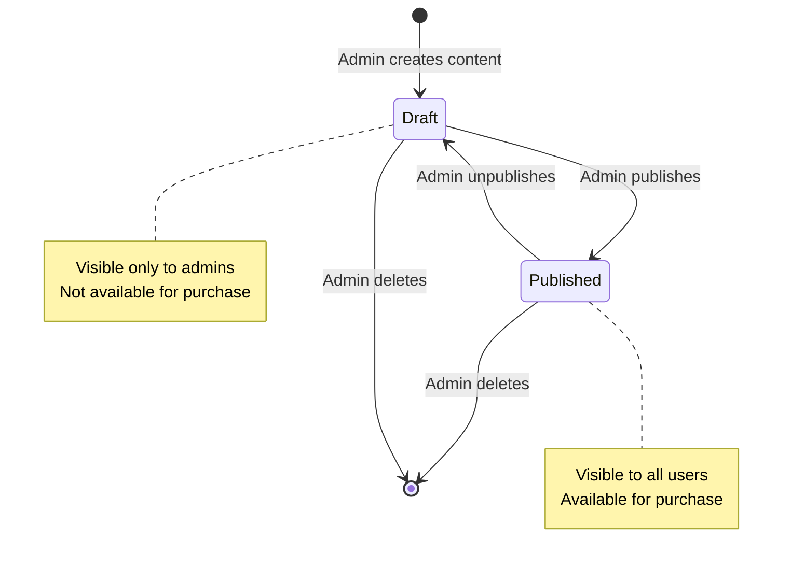
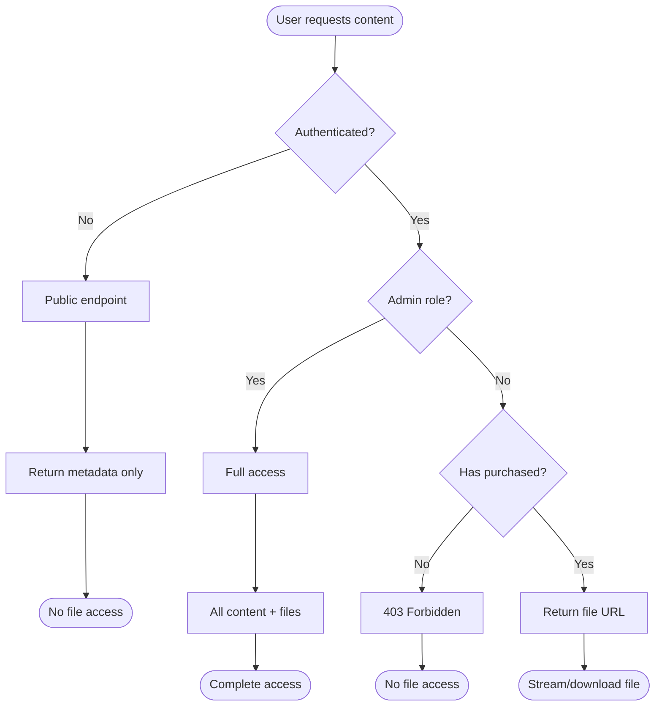

## Overview

The Vaniyk Empire API supports three types of digital content: PDFs, videos, and audio files. Content management involves uploading files to Cloudinary, storing metadata in MongoDB, and controlling access based on purchase status.

## Content Types

The system supports three distinct content types, each with specific handling:

<CardGroup cols={3}>
  <Card title="PDF" icon="file-pdf">
    Documents and ebooks stored as Cloudinary `image` resource type
  </Card>
  
  <Card title="Video" icon="video">
    Video content with duration tracking, stored as `video` resource type
  </Card>
  
  <Card title="Audio" icon="music">
    Audio files with duration tracking, stored as `video` resource type
  </Card>
</CardGroup>

## Content Model Schema

Every content item in the database follows this structure:

<CodeGroup>
```javascript Content Schema
const contentSchema = new mongoose.Schema({
  // Basic Information
  title: {
    type: String,
    required: true
  },
  description: {
    type: String,
    required: true
  },
  type: {
    type: String,
    enum: ['pdf', 'video', 'audio'],
    required: true
  },
  category: {
    type: String,
    required: true
  },
  price: {
    type: Number,
    required: true,
    min: 0
  },
  
  // File Storage
  fileUrl: {
    type: String,
    required: true
  },
  filePublicId: {
    type: String,
    required: true
  },
  thumbnailUrl: {
    type: String
  },
  thumbnailPublicId: {
    type: String
  },
  
  // Metadata
  duration: {
    type: Number  // For video/audio - in seconds
  },
  fileSize: {
    type: Number  // In bytes
  },
  status: {
    type: String,
    enum: ['draft', 'published'],
    default: 'draft'
  },
  tags: [{
    type: String
  }],
  
  // Tracking
  createdBy: {
    type: mongoose.Schema.Types.ObjectId,
    ref: 'User',
    required: true
  },
  createdAt: {
    type: Date,
    default: Date.now
  },
  updatedAt: {
    type: Date,
    default: Date.now
  }
});

// Text search index
contentSchema.index({ title: 'text', description: 'text', tags: 'text' });
```
</CodeGroup>

<Info>
The text search index on `title`, `description`, and `tags` enables full-text search functionality across content items.
</Info>

## File Upload Flow

Content uploads use Multer with Cloudinary storage to handle file uploads directly to the cloud.

### Upload Configuration

The upload system is configured in `/workspace/source/src/config/cloudinary.js:12`:

<CodeGroup>
```javascript Multer-Cloudinary Setup
const contentStorage = new CloudinaryStorage({
  cloudinary: cloudinary,
  params: async (req, file) => {
    let folder = 'content';
    let resourceType = 'auto';

    // Organize files by type
    if (file.fieldname === 'thumbnail') {
      folder = 'content/thumbnails';
      resourceType = 'image';
    } else if (file.mimetype.startsWith('video/')) {
      folder = 'content/videos';
      resourceType = 'video';
    } else if (file.mimetype.startsWith('audio/')) {
      folder = 'content/audio';
      resourceType = 'video';  // Audio stored as video type
    } else if (file.mimetype === 'application/pdf') {
      folder = 'content/pdfs';
      resourceType = 'image';  // PDFs stored as image type
    }

    return {
      folder: folder,
      resource_type: resourceType,
    };
  }
});

const uploadContent = multer({ 
  storage: contentStorage,
  limits: {
    fileSize: 500 * 1024 * 1024 // 500MB limit
  }
});
```
</CodeGroup>

<Warning>
The 500MB file size limit is enforced at the application level. Ensure your Cloudinary account supports files of this size.
</Warning>

### Cloudinary Folder Structure

Files are automatically organized in Cloudinary:

```
content/
├── pdfs/           # PDF documents
├── videos/         # Video files
├── audio/          # Audio files
└── thumbnails/     # Content thumbnails
```

### Upload Endpoint

Admins can create content via the POST endpoint with multipart form data:

<CodeGroup>
```javascript Route Definition
router.post('/', 
  authenticate,              // Verify user is logged in
  requireAdmin,              // Verify user is admin
  uploadContent.fields([     // Handle file uploads
    { name: 'file', maxCount: 1 },
    { name: 'thumbnail', maxCount: 1 }
  ]),
  contentController.createContent
);
```

```bash cURL Example
curl -X POST https://api.example.com/api/content \
  -H "Authorization: Bearer <token>" \
  -F "title=Advanced Node.js Patterns" \
  -F "description=Learn advanced Node.js techniques" \
  -F "type=pdf" \
  -F "category=programming" \
  -F "price=29.99" \
  -F "status=published" \
  -F "tags=[\"nodejs\", \"javascript\", \"backend\"]" \
  -F "file=@/path/to/ebook.pdf" \
  -F "thumbnail=@/path/to/cover.jpg"
```
</CodeGroup>

### Create Content Logic

The controller handles the complete upload and database creation flow:

<CodeGroup>
```javascript Create Content Controller
exports.createContent = async (req, res) => {
  try {
    const { 
      title, 
      description, 
      type, 
      category, 
      price, 
      status,
      tags 
    } = req.body;

    // Validate file upload
    if (!req.files || !req.files.file) {
      return res.status(400).json({ error: 'Content file is required' });
    }

    const file = req.files.file[0];
    const thumbnail = req.files.thumbnail ? req.files.thumbnail[0] : null;

    // Create database record
    const content = await Content.create({
      title,
      description,
      type,
      category,
      price,
      fileUrl: file.path,              // Cloudinary URL
      filePublicId: file.filename,      // Cloudinary public ID
      thumbnailUrl: thumbnail?.path || null,
      thumbnailPublicId: thumbnail?.filename || null,
      duration: file.duration || null,  // Auto-detected for video/audio
      fileSize: file.bytes,             // File size in bytes
      status: status || 'draft',
      tags: tags ? JSON.parse(tags) : [],
      createdBy: req.mongoUser._id
    });

    await content.populate('createdBy', 'name email');

    res.status(201).json({ 
      message: 'Content created successfully',
      content 
    });
  } catch (error) {
    res.status(500).json({ error: error.message });
  }
};
```
</CodeGroup>

<Note>
Cloudinary automatically extracts metadata like `duration` for video/audio files and `bytes` for file size. These values are stored in the database for quick access.
</Note>

## Content Lifecycle



## Content Status

Content can be in one of two states:

<Tabs>
  <Tab title="Draft">
    **Draft content:**
    - Not visible in public listings
    - Cannot be purchased
    - Visible only to admin users
    - Used for content preparation
    
    ```javascript
    { status: 'draft' }
    ```
  </Tab>
  
  <Tab title="Published">
    **Published content:**
    - Visible in public listings
    - Available for purchase
    - Accessible to all users
    - File URL hidden until purchased
    
    ```javascript
    { status: 'published' }
    ```
  </Tab>
</Tabs>

## Access Control

The API implements a three-tier access control system:

### 1. Public Access (Unauthenticated)

Anyone can browse published content metadata:

<CodeGroup>
```javascript List Content
GET /api/content

Response:
{
  "content": [
    {
      "_id": "...",
      "title": "Advanced Node.js Patterns",
      "description": "...",
      "type": "pdf",
      "category": "programming",
      "price": 29.99,
      "thumbnailUrl": "https://res.cloudinary.com/...",
      "duration": null,
      "fileSize": 5242880,
      "status": "published",
      "tags": ["nodejs", "javascript"],
      "createdBy": { "name": "Admin User" },
      // Note: fileUrl and filePublicId are excluded
    }
  ],
  "totalPages": 5,
  "currentPage": 1,
  "totalContent": 47
}
```
</CodeGroup>

<Info>
Public endpoints explicitly exclude `fileUrl` and `filePublicId` fields to prevent unauthorized access to content files.
</Info>

### 2. Authenticated User Access

Authenticated users who have purchased content can access the file:

<CodeGroup>
```javascript Access Purchased Content
GET /api/content/:contentId/access
Authorization: Bearer <token>

// Access control logic
const purchase = await Purchase.findOne({
  user: userId,
  content: contentId,
  status: 'completed'
});

if (!purchase) {
  return res.status(403).json({ 
    error: 'You need to purchase this content to access it' 
  });
}

// Return full content including fileUrl
const content = await Content.findOne({ 
  _id: contentId, 
  status: 'published' 
});

res.json({ content });
```
</CodeGroup>

### 3. Admin Access

Admins have full access to all content, including drafts:

<CodeGroup>
```javascript Admin Get All Content
GET /api/content/admin/all
Authorization: Bearer <token>

// No purchase check required
// Includes both draft and published content
// Returns all fields including fileUrl
```
</CodeGroup>

## Access Flow Diagram



## Updating Content

Admins can update content, including replacing files:

<CodeGroup>
```javascript Update Content
exports.updateContent = async (req, res) => {
  const { contentId } = req.params;
  const updates = req.body;

  const content = await Content.findById(contentId);
  
  if (!content) {
    return res.status(404).json({ error: 'Content not found' });
  }

  // Handle file replacement
  if (req.files?.file) {
    // Delete old file from Cloudinary
    if (content.filePublicId) {
      const resourceType = content.type === 'pdf' ? 'image' : 'video';
      await cloudinary.uploader.destroy(content.filePublicId, {
        resource_type: resourceType
      });
    }

    // Update with new file
    const file = req.files.file[0];
    content.fileUrl = file.path;
    content.filePublicId = file.filename;
    content.duration = file.duration || content.duration;
    content.fileSize = file.bytes;
  }

  // Update metadata
  Object.keys(updates).forEach(key => {
    if (key === 'tags' && typeof updates[key] === 'string') {
      content[key] = JSON.parse(updates[key]);
    } else if (key !== 'file' && key !== 'thumbnail') {
      content[key] = updates[key];
    }
  });

  content.updatedAt = new Date();
  await content.save();
};
```
</CodeGroup>

<Warning>
When updating content files, the old file is automatically deleted from Cloudinary to prevent orphaned files and excessive storage usage.
</Warning>

## Deleting Content

Deleting content removes both database records and Cloudinary files:

<CodeGroup>
```javascript Delete Content
exports.deleteContent = async (req, res) => {
  const { contentId } = req.params;
  const content = await Content.findById(contentId);
  
  if (!content) {
    return res.status(404).json({ error: 'Content not found' });
  }

  // Delete main file from Cloudinary
  if (content.filePublicId) {
    const resourceType = content.type === 'pdf' ? 'image' : 'video';
    await cloudinary.uploader.destroy(content.filePublicId, {
      resource_type: resourceType
    });
  }

  // Delete thumbnail from Cloudinary
  if (content.thumbnailPublicId) {
    await cloudinary.uploader.destroy(content.thumbnailPublicId);
  }

  // Delete database record
  await Content.findByIdAndDelete(contentId);

  res.json({ message: 'Content and files deleted successfully' });
};
```
</CodeGroup>

## Search and Filtering

The list endpoint supports powerful filtering:

<CodeGroup>
```javascript Query Parameters
GET /api/content?
  page=1&
  limit=10&
  category=programming&
  type=pdf&
  minPrice=10&
  maxPrice=50&
  search=nodejs

// Controller logic
const query = { status: 'published' };

if (category) query.category = category;
if (type) query.type = type;

if (minPrice || maxPrice) {
  query.price = {};
  if (minPrice) query.price.$gte = Number(minPrice);
  if (maxPrice) query.price.$lte = Number(maxPrice);
}

if (search) {
  query.$text = { $search: search };
}

const content = await Content.find(query)
  .select('-fileUrl -filePublicId')
  .populate('createdBy', 'name')
  .limit(limit * 1)
  .skip((page - 1) * limit)
  .sort({ createdAt: -1 });
```
</CodeGroup>

<Tip>
The text search uses MongoDB's text index on `title`, `description`, and `tags`, providing fast and relevant search results.
</Tip>

## User Purchase History

Users can retrieve their purchased content:

<CodeGroup>
```javascript Get User Purchases
GET /api/content/user/purchases?page=1&limit=10
Authorization: Bearer <token>

exports.getUserPurchases = async (req, res) => {
  const userId = req.mongoUser._id;
  const { page = 1, limit = 10 } = req.query;

  const purchases = await Purchase.find({
    user: userId,
    status: 'completed'
  })
  .populate({
    path: 'content',
    select: 'title description type category price thumbnailUrl'
  })
  .limit(limit * 1)
  .skip((page - 1) * limit)
  .sort({ purchasedAt: -1 });

  const count = await Purchase.countDocuments({
    user: userId,
    status: 'completed'
  });

  res.json({
    purchases,
    totalPages: Math.ceil(count / limit),
    currentPage: Number(page),
    totalPurchases: count
  });
};
```
</CodeGroup>

## Best Practices

<CardGroup cols={2}>
  <Card title="Use Drafts" icon="pen-to-square">
    Create content as drafts first, review, then publish to avoid exposing incomplete content
  </Card>
  
  <Card title="Add Thumbnails" icon="image">
    Always upload thumbnails for better user experience in content listings
  </Card>
  
  <Card title="Tag Appropriately" icon="tags">
    Use descriptive tags to improve searchability and content discovery
  </Card>
  
  <Card title="Set Correct Types" icon="file-circle-check">
    Ensure content type matches file type for proper Cloudinary handling
  </Card>
</CardGroup>

## Next Steps

<CardGroup cols={2}>
  <Card title="Payment Flow" icon="credit-card" href="/concepts/payment-flow">
    Learn how payments work for content purchases
  </Card>
  
  <Card title="Content API Reference" icon="book" href="/api-reference/content/list-content">
    Explore the complete Content API documentation
  </Card>
</CardGroup>