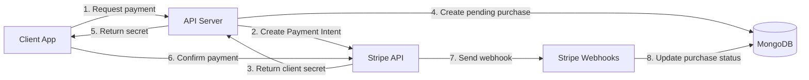
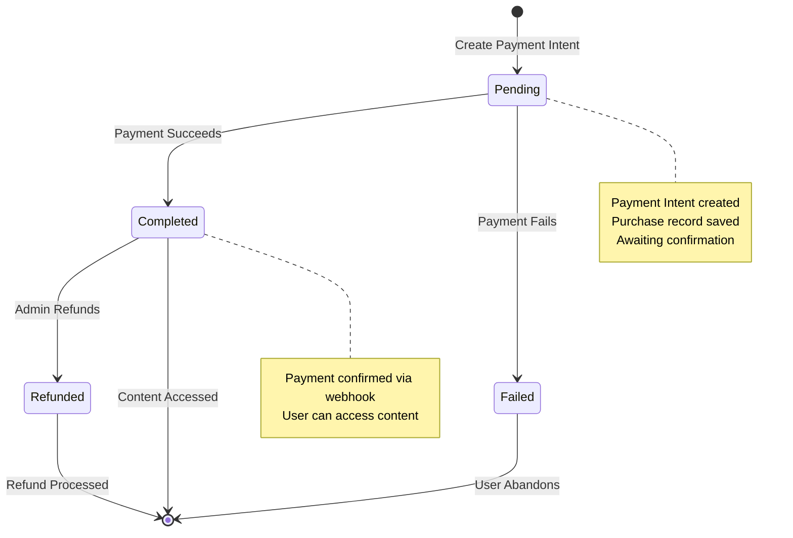
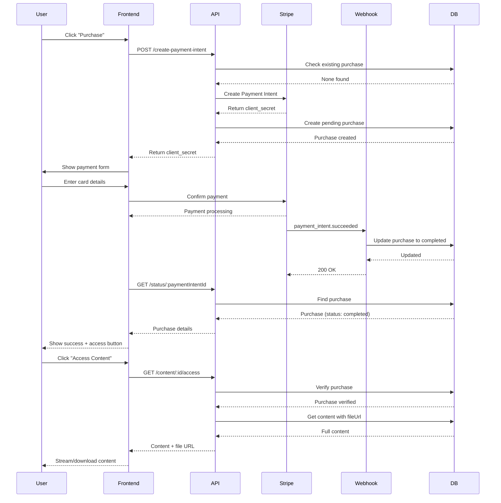

## Overview

The Vaniyk Empire API uses Stripe to handle all payment processing. The payment flow follows a secure, asynchronous pattern using Payment Intents and webhooks to ensure reliable payment confirmation and content access.

## Payment Architecture



## Payment Lifecycle

The complete payment process follows these stages:



## Purchase Model

Every payment creates a Purchase record:

<CodeGroup>
```javascript Purchase Schema
const purchaseSchema = new mongoose.Schema({
  user: {
    type: mongoose.Schema.Types.ObjectId,
    ref: 'User',
    required: true
  },
  content: {
    type: mongoose.Schema.Types.ObjectId,
    ref: 'Content',
    required: true
  },
  amount: {
    type: Number,
    required: true
  },
  stripePaymentIntentId: {
    type: String
  },
  status: {
    type: String,
    enum: ['pending', 'completed', 'failed', 'refunded'],
    default: 'pending'
  },
  purchasedAt: {
    type: Date,
    default: Date.now
  }
});

// Compound index prevents duplicate purchases
purchaseSchema.index({ user: 1, content: 1 });
```
</CodeGroup>

<Info>
The compound index on `(user, content)` enables fast duplicate purchase checking and prevents users from purchasing the same content multiple times.
</Info>

## Step 1: Creating a Payment Intent

The payment flow begins when a user initiates a purchase:

<CodeGroup>
```javascript API Request
POST /api/payments/create-payment-intent
Authorization: Bearer <token>

{
  "contentId": "64f8a..."
}
```

```javascript Controller Logic
exports.createPaymentIntent = async (req, res) => {
  try {
    const { contentId } = req.body;
    const userId = req.mongoUser._id;

    // 1. Verify content exists and is published
    const content = await Content.findOne({ 
      _id: contentId, 
      status: 'published' 
    });

    if (!content) {
      return res.status(404).json({ error: 'Content not found' });
    }

    // 2. Check for existing purchase
    const existingPurchase = await Purchase.findOne({
      user: userId,
      content: contentId,
      status: 'completed'
    });

    if (existingPurchase) {
      return res.status(400).json({ 
        error: 'You have already purchased this content' 
      });
    }

    // 3. Create Stripe Payment Intent
    const paymentIntent = await stripe.paymentIntents.create({
      amount: Math.round(content.price * 100), // Convert to cents
      currency: 'usd',
      metadata: {
        contentId: content._id.toString(),
        userId: userId.toString(),
        contentTitle: content.title
      }
    });

    // 4. Create pending purchase record
    await Purchase.create({
      user: userId,
      content: contentId,
      amount: content.price,
      stripePaymentIntentId: paymentIntent.id,
      status: 'pending'
    });

    // 5. Return client secret to frontend
    res.json({
      clientSecret: paymentIntent.client_secret,
      amount: content.price
    });
  } catch (error) {
    res.status(500).json({ error: error.message });
  }
};
```
</CodeGroup>

<Warning>
Stripe requires amounts in the smallest currency unit (cents for USD). Always multiply dollar amounts by 100: `Math.round(content.price * 100)`
</Warning>

### Payment Intent Metadata

The payment intent includes metadata to link payments back to the application:

<CodeGroup>
```javascript Metadata Structure
{
  contentId: "64f8a1b2c3d4e5f6g7h8i9j0",  // MongoDB content ID
  userId: "64f8a1b2c3d4e5f6g7h8i9j1",     // MongoDB user ID
  contentTitle: "Advanced Node.js Patterns" // For reference
}
```
</CodeGroup>

## Step 2: Client-Side Payment Confirmation

After receiving the client secret, the frontend uses Stripe.js to collect payment:

<CodeGroup>
```javascript Frontend Flow (Example)
import { loadStripe } from '@stripe/stripe-js';

// 1. Initialize Stripe
const stripe = await loadStripe('pk_test_...');

// 2. Request payment intent
const response = await fetch('/api/payments/create-payment-intent', {
  method: 'POST',
  headers: {
    'Content-Type': 'application/json',
    'Authorization': `Bearer ${token}`
  },
  body: JSON.stringify({ contentId: '64f8a...' })
});

const { clientSecret } = await response.json();

// 3. Confirm payment with Stripe
const { error, paymentIntent } = await stripe.confirmCardPayment(
  clientSecret,
  {
    payment_method: {
      card: cardElement,
      billing_details: { name: 'John Doe' }
    }
  }
);

if (error) {
  console.error('Payment failed:', error.message);
} else if (paymentIntent.status === 'succeeded') {
  console.log('Payment successful!');
  // Wait for webhook to update database
}
```
</CodeGroup>

<Tip>
Don't rely on the client-side payment status to grant access. Always wait for webhook confirmation to ensure security.
</Tip>

## Step 3: Webhook Processing

Stripe sends webhooks to notify the server of payment events. This is the **only reliable way** to confirm payments.

### Webhook Route Configuration

<CodeGroup>
```javascript Route Setup
// CRITICAL: Webhook route MUST use raw body
router.post(
  '/webhook',
  express.raw({ type: 'application/json' }),  // Raw body for signature verification
  paymentController.handleWebhook
);
```
</CodeGroup>

<Warning>
The webhook route MUST be registered BEFORE `express.json()` middleware in server.js to receive raw request bodies for signature verification.
</Warning>

### Webhook Handler

The webhook handler verifies signatures and processes events:

<CodeGroup>
```javascript Webhook Controller
exports.handleWebhook = async (req, res) => {
  const sig = req.headers['stripe-signature'];
  let event;

  try {
    // 1. Verify webhook signature
    event = stripe.webhooks.constructEvent(
      req.body,
      sig,
      process.env.STRIPE_WEBHOOK_SECRET
    );
  } catch (err) {
    console.error('Webhook signature verification failed:', err.message);
    return res.status(400).send(`Webhook Error: ${err.message}`);
  }

  // 2. Handle the event
  switch (event.type) {
    case 'payment_intent.succeeded':
      await handlePaymentSuccess(event.data.object);
      break;
    
    case 'payment_intent.payment_failed':
      await handlePaymentFailed(event.data.object);
      break;

    default:
      console.log(`Unhandled event type ${event.type}`);
  }

  // 3. Acknowledge receipt
  res.json({ received: true });
};
```
</CodeGroup>

### Payment Success Handler

<CodeGroup>
```javascript Handle Success
const handlePaymentSuccess = async (paymentIntent) => {
  try {
    // Find purchase by Stripe Payment Intent ID
    const purchase = await Purchase.findOne({
      stripePaymentIntentId: paymentIntent.id
    });

    if (purchase) {
      // Update status to completed
      purchase.status = 'completed';
      await purchase.save();
      
      console.log(`Payment completed for purchase ${purchase._id}`);
      
      // Here you could also:
      // - Send confirmation email
      // - Update analytics
      // - Trigger notifications
    }
  } catch (error) {
    console.error('Error handling payment success:', error);
  }
};
```
</CodeGroup>

### Payment Failure Handler

<CodeGroup>
```javascript Handle Failure
const handlePaymentFailed = async (paymentIntent) => {
  try {
    const purchase = await Purchase.findOne({
      stripePaymentIntentId: paymentIntent.id
    });

    if (purchase) {
      purchase.status = 'failed';
      await purchase.save();
      
      console.log(`Payment failed for purchase ${purchase._id}`);
      
      // Optionally notify user of failure
    }
  } catch (error) {
    console.error('Error handling payment failure:', error);
  }
};
```
</CodeGroup>

## Step 4: Accessing Purchased Content

Once a payment is completed, users can access the content:

<CodeGroup>
```javascript Access Content
GET /api/content/:contentId/access
Authorization: Bearer <token>

exports.accessContent = async (req, res) => {
  try {
    const { contentId } = req.params;
    const userId = req.mongoUser._id;

    // 1. Verify purchase exists and is completed
    const purchase = await Purchase.findOne({
      user: userId,
      content: contentId,
      status: 'completed'  // Only completed purchases grant access
    });

    if (!purchase) {
      return res.status(403).json({ 
        error: 'You need to purchase this content to access it' 
      });
    }

    // 2. Retrieve full content including file URL
    const content = await Content.findOne({ 
      _id: contentId, 
      status: 'published' 
    })
    .populate('createdBy', 'name');
    
    if (!content) {
      return res.status(404).json({ error: 'Content not found' });
    }

    // 3. Return complete content with file URL
    res.json({ content });
  } catch (error) {
    res.status(500).json({ error: error.message });
  }
};
```
</CodeGroup>

<Info>
Only purchases with `status: 'completed'` grant content access. Pending, failed, or refunded purchases are denied.
</Info>

## Payment Status Checking

Clients can check payment status after submission:

<CodeGroup>
```javascript Check Status
GET /api/payments/status/:paymentIntentId
Authorization: Bearer <token>

exports.getPaymentStatus = async (req, res) => {
  try {
    const { paymentIntentId } = req.params;
    const userId = req.mongoUser._id;

    const purchase = await Purchase.findOne({
      stripePaymentIntentId: paymentIntentId,
      user: userId
    }).populate('content', 'title description type thumbnailUrl');

    if (!purchase) {
      return res.status(404).json({ error: 'Payment not found' });
    }

    res.json({ purchase });
  } catch (error) {
    res.status(500).json({ error: error.message });
  }
};
```

```json Response Example
{
  "purchase": {
    "_id": "64f8a...",
    "user": "64f8a...",
    "content": {
      "_id": "64f8a...",
      "title": "Advanced Node.js Patterns",
      "description": "...",
      "type": "pdf",
      "thumbnailUrl": "https://..."
    },
    "amount": 29.99,
    "stripePaymentIntentId": "pi_...",
    "status": "completed",
    "purchasedAt": "2024-03-15T10:30:00.000Z"
  }
}
```
</CodeGroup>

## Admin Payment Management

### View All Payments

Admins can view all payments across the platform:

<CodeGroup>
```javascript Get All Payments
GET /api/payments/admin/all?page=1&limit=20&status=completed
Authorization: Bearer <admin-token>

exports.getAllPayments = async (req, res) => {
  try {
    const { page = 1, limit = 20, status } = req.query;
    
    const query = {};
    if (status) query.status = status;

    const purchases = await Purchase.find(query)
      .populate('user', 'name email')
      .populate('content', 'title type')
      .limit(limit * 1)
      .skip((page - 1) * limit)
      .sort({ purchasedAt: -1 });

    const count = await Purchase.countDocuments(query);

    res.json({
      purchases,
      totalPages: Math.ceil(count / limit),
      currentPage: Number(page),
      totalPurchases: count
    });
  } catch (error) {
    res.status(500).json({ error: error.message });
  }
};
```
</CodeGroup>

### Process Refunds

Admins can issue refunds for completed purchases:

<CodeGroup>
```javascript Refund Payment
POST /api/payments/admin/refund/:purchaseId
Authorization: Bearer <admin-token>

exports.refundPayment = async (req, res) => {
  try {
    const { purchaseId } = req.params;

    // 1. Find purchase
    const purchase = await Purchase.findById(purchaseId);

    if (!purchase) {
      return res.status(404).json({ error: 'Purchase not found' });
    }

    // 2. Validate refund eligibility
    if (purchase.status !== 'completed') {
      return res.status(400).json({ 
        error: 'Only completed purchases can be refunded' 
      });
    }

    // 3. Create refund in Stripe
    const refund = await stripe.refunds.create({
      payment_intent: purchase.stripePaymentIntentId
    });

    // 4. Update purchase status
    if (refund.status === 'succeeded') {
      purchase.status = 'refunded';
      await purchase.save();

      res.json({ 
        message: 'Refund successful',
        purchase 
      });
    } else {
      res.status(400).json({ error: 'Refund failed' });
    }
  } catch (error) {
    res.status(500).json({ error: error.message });
  }
};
```
</CodeGroup>

<Warning>
Refunding a purchase updates the status to `refunded`, which automatically revokes content access.
</Warning>

## Payment States

<Tabs>
  <Tab title="Pending">
    **Pending Purchase**
    
    - Payment Intent created
    - Purchase record saved in database
    - Awaiting payment confirmation
    - No content access granted
    
    **Triggers:**
    - User initiates purchase
    - Payment Intent created successfully
    
    **Next States:**
    - `completed` (payment succeeds)
    - `failed` (payment fails)
  </Tab>
  
  <Tab title="Completed">
    **Completed Purchase**
    
    - Payment confirmed via webhook
    - User can access content
    - Shows in purchase history
    - Can be refunded by admin
    
    **Triggers:**
    - `payment_intent.succeeded` webhook received
    - Webhook handler updates status
    
    **Next States:**
    - `refunded` (admin issues refund)
  </Tab>
  
  <Tab title="Failed">
    **Failed Purchase**
    
    - Payment attempt failed
    - No content access granted
    - Purchase record retained for analytics
    
    **Triggers:**
    - `payment_intent.payment_failed` webhook received
    - Card declined, insufficient funds, etc.
    
    **Next States:**
    - Terminal state (user can create new purchase)
  </Tab>
  
  <Tab title="Refunded">
    **Refunded Purchase**
    
    - Admin issued refund through Stripe
    - Content access revoked
    - Refund processed to original payment method
    
    **Triggers:**
    - Admin calls refund endpoint
    - Stripe refund succeeds
    
    **Next States:**
    - Terminal state
  </Tab>
</Tabs>

## Webhook Security

Webhook signature verification is critical for security:

<Steps>
  <Step title="Stripe Signs Webhook">
    Stripe generates a signature using your webhook secret and includes it in the `stripe-signature` header
  </Step>
  
  <Step title="Server Receives Request">
    The raw request body is preserved by using `express.raw()` middleware
  </Step>
  
  <Step title="Signature Verification">
    `stripe.webhooks.constructEvent()` verifies the signature matches the body
  </Step>
  
  <Step title="Process or Reject">
    If verification succeeds, process the event. If it fails, return 400 to reject the webhook
  </Step>
</Steps>

<CodeGroup>
```javascript Signature Verification
try {
  event = stripe.webhooks.constructEvent(
    req.body,                            // Raw body (Buffer)
    req.headers['stripe-signature'],     // Signature header
    process.env.STRIPE_WEBHOOK_SECRET    // Your webhook secret
  );
} catch (err) {
  // Invalid signature - reject webhook
  return res.status(400).send(`Webhook Error: ${err.message}`);
}
```
</CodeGroup>

## Complete Payment Sequence



## Error Handling

<AccordionGroup>
  <Accordion title="Content Not Found" icon="circle-exclamation">
    ```javascript
    // Status: 404
    { "error": "Content not found" }
    ```
    
    **Causes:**
    - Content ID doesn't exist
    - Content is not published
    - Content was deleted
  </Accordion>
  
  <Accordion title="Already Purchased" icon="circle-check">
    ```javascript
    // Status: 400
    { "error": "You have already purchased this content" }
    ```
    
    **Causes:**
    - User has completed purchase for this content
    - Prevents duplicate charges
    
    **Solution:**
    - Direct user to access content instead
  </Accordion>
  
  <Accordion title="Payment Failed" icon="credit-card">
    ```javascript
    // Webhook event: payment_intent.payment_failed
    ```
    
    **Causes:**
    - Card declined
    - Insufficient funds
    - Invalid card details
    
    **Handling:**
    - Purchase status set to 'failed'
    - User can retry with different payment method
  </Accordion>
  
  <Accordion title="Access Denied" icon="lock">
    ```javascript
    // Status: 403
    { "error": "You need to purchase this content to access it" }
    ```
    
    **Causes:**
    - No completed purchase found
    - Purchase was refunded
    - Payment still pending
  </Accordion>
</AccordionGroup>

## Best Practices

<CardGroup cols={2}>
  <Card title="Always Use Webhooks" icon="webhook">
    Never trust client-side payment confirmation. Always wait for webhook events to update purchase status.
  </Card>
  
  <Card title="Verify Signatures" icon="signature">
    Always verify webhook signatures to prevent fraudulent requests from unauthorized sources.
  </Card>
  
  <Card title="Idempotent Handlers" icon="arrows-rotate">
    Design webhook handlers to be idempotent since Stripe may send the same event multiple times.
  </Card>
  
  <Card title="Log Everything" icon="file-lines">
    Log all payment events, webhook processing, and errors for debugging and audit trails.
  </Card>
</CardGroup>

## Testing Webhooks

Use Stripe CLI to test webhooks locally:

<CodeGroup>
```bash Install Stripe CLI
# Install Stripe CLI
brew install stripe/stripe-cli/stripe

# Login to Stripe
stripe login

# Forward webhooks to local server
stripe listen --forward-to localhost:3000/api/payments/webhook

# Trigger test events
stripe trigger payment_intent.succeeded
stripe trigger payment_intent.payment_failed
```
</CodeGroup>

<Tip>
The Stripe CLI provides a webhook signing secret for local testing. Use this in your `.env` file during development.
</Tip>

## Next Steps

<CardGroup cols={2}>
  <Card title="Architecture Overview" icon="sitemap" href="/concepts/architecture">
    Review the complete system architecture
  </Card>
  
  <Card title="Payment API Reference" icon="book" href="/api-reference/payments/create-payment-intent">
    Explore the complete Payment API documentation
  </Card>
</CardGroup>